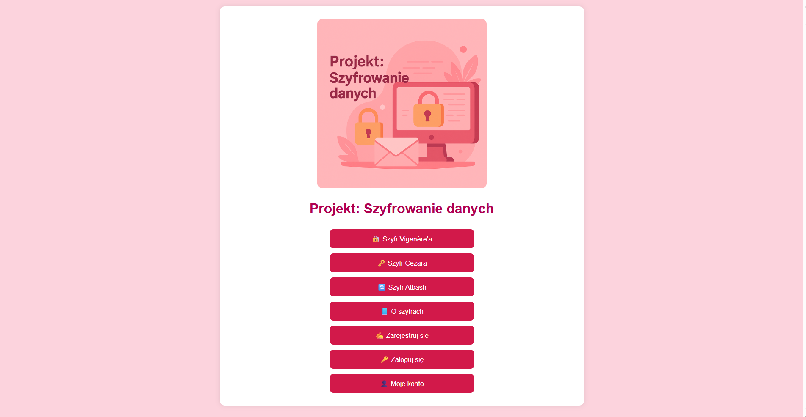
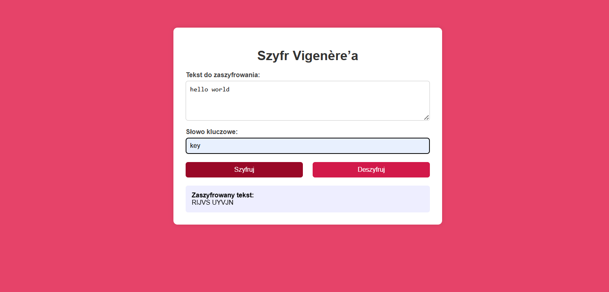
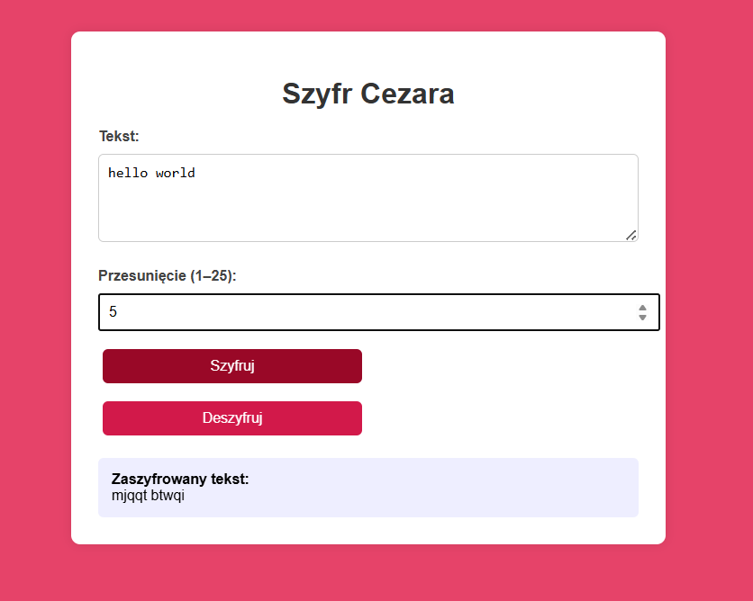
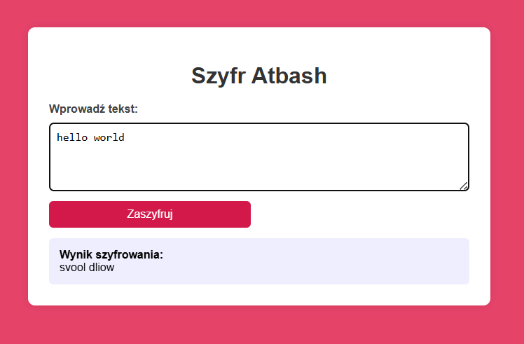
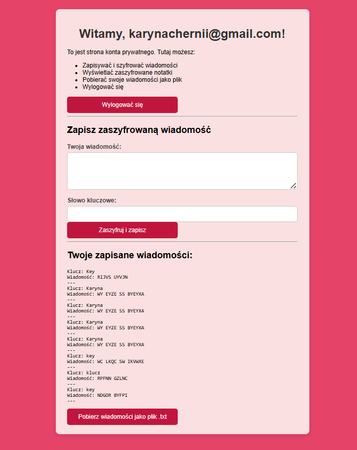
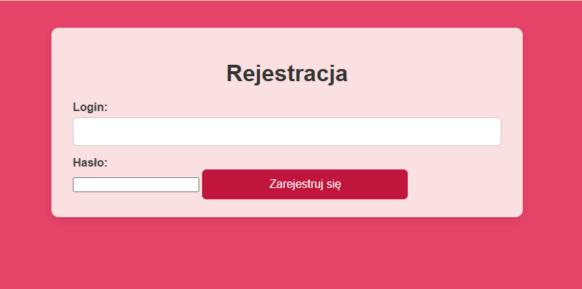
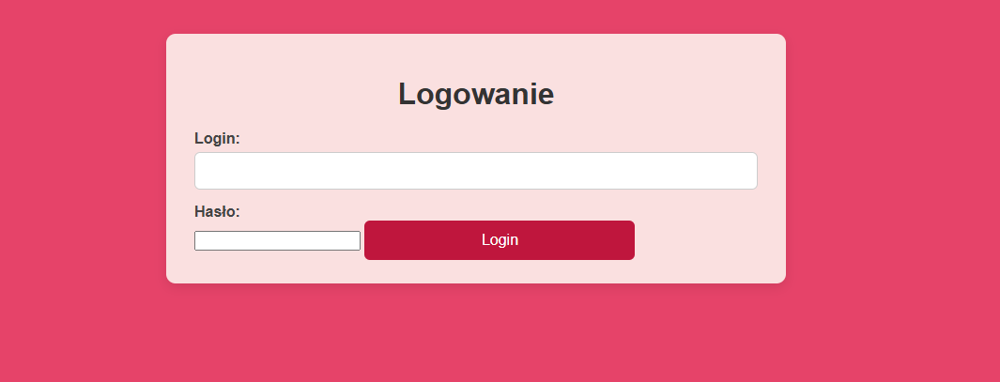

# Aplikacja webowa do szyfrowania i deszyfrowania tekstu  

**Stack:** HTML, CSS, JavaScript, PHP, XAMPP  
**Rola:** Full-Stack Developer (projekt studencki)  

## Opis
Projekt został zrealizowany w ramach przedmiotu **Bezpieczeństwo systemów informatycznych**.  
Celem było stworzenie funkcjonalnej aplikacji webowej umożliwiającej szyfrowanie i deszyfrowywanie danych z wykorzystaniem klasycznych algorytmów kryptograficznych.  

Dodatkowo aplikacja zawiera system logowania z bezpiecznym przechowywaniem haseł oraz panel użytkownika do zarządzania zaszyfrowanymi wiadomościami.  

## Funkcje
- Implementacja trzech szyfrów klasycznych:
  - **Szyfr Cezara**  
  - **Szyfr Vigenère’a**  
  - **Szyfr Atbash**  
- Rejestracja i logowanie użytkowników (hasła haszowane przy użyciu `password_hash()`)  
- Zapisywanie własnych zaszyfrowanych wiadomości w panelu użytkownika  
- Możliwość pobrania wiadomości jako pliku `.txt`  
- Podstrona z opisem działania użytych szyfrów  

## Dokumentacja
Pełny raport projektu (cele, technologie, działanie szyfrów, wnioski) dostępny jest w pliku PDF.  
 [Raport projektu (PDF)](../../docs/szyfry.pdf)

## Zrzuty ekranu

## Wnioski
Projekt pozwolił mi zastosować wiedzę z zakresu **kryptografii klasycznej** i bezpieczeństwa aplikacji webowych.  
Nauczyłam się:  
- tworzyć formularze i obsługiwać dane użytkowników w PHP,  
- implementować bezpieczne logowanie z haszowaniem haseł,  
- zapisywać i odczytywać dane z plików tekstowych,  
- łączyć frontend (HTML, CSS, JS) z backendem (PHP, XAMPP).  