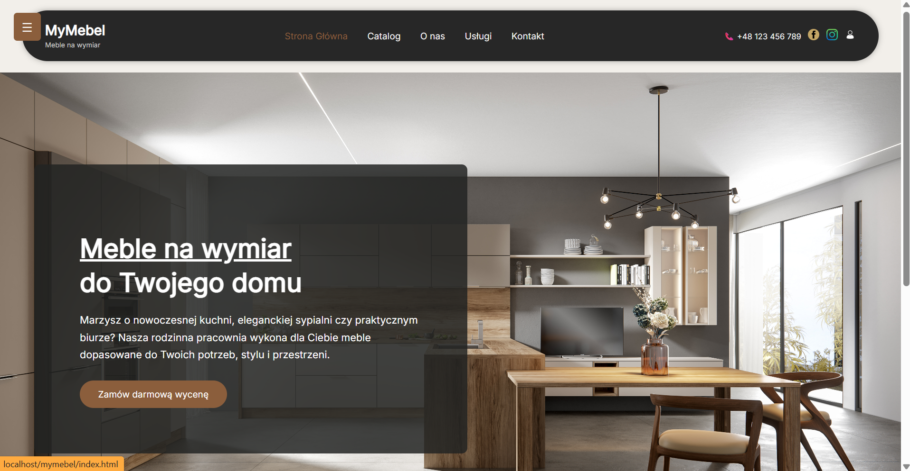
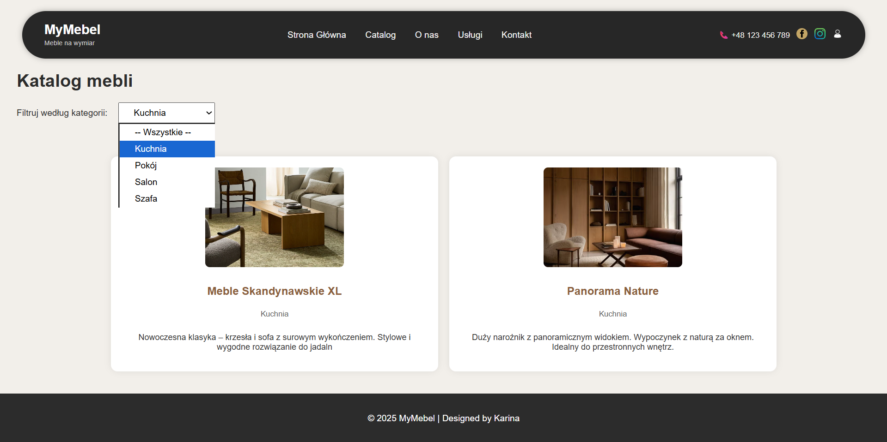
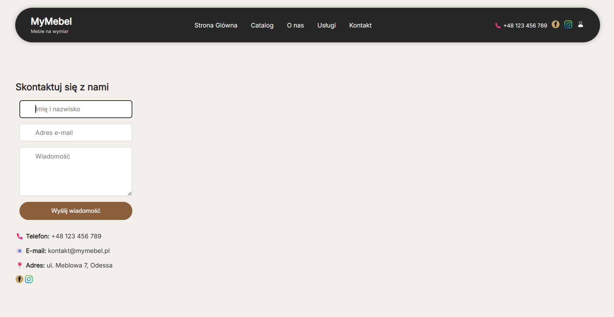
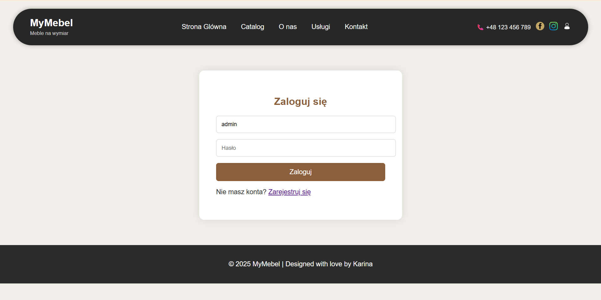
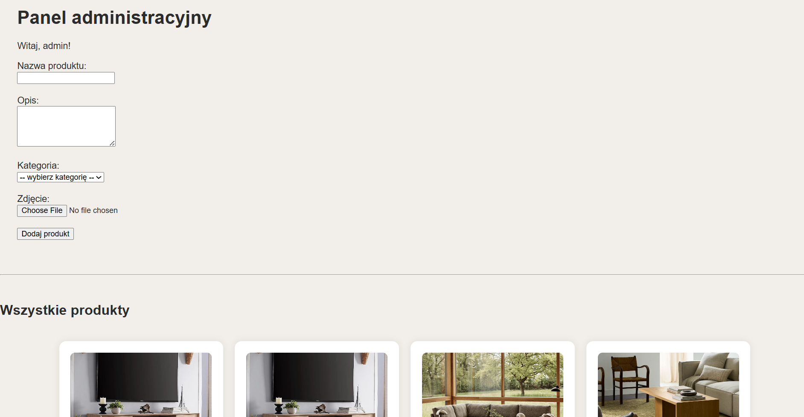
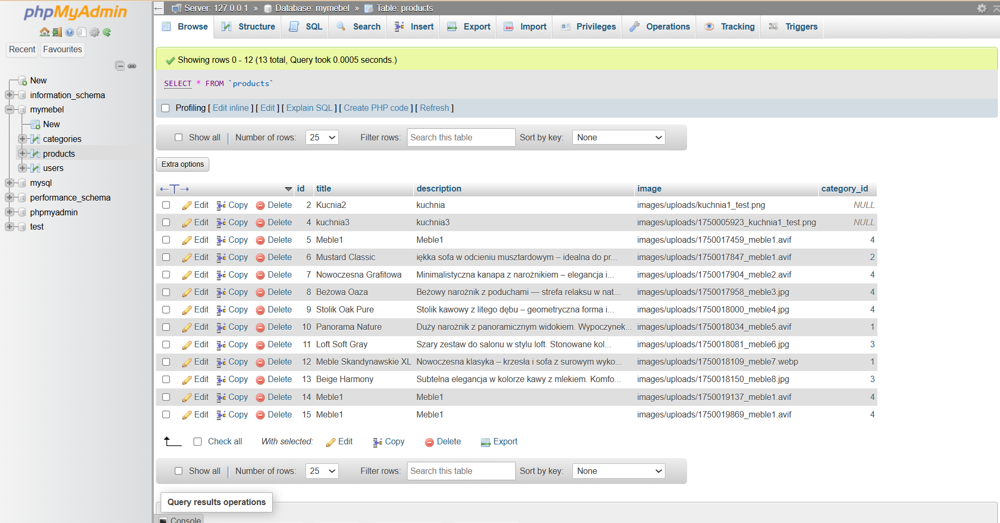
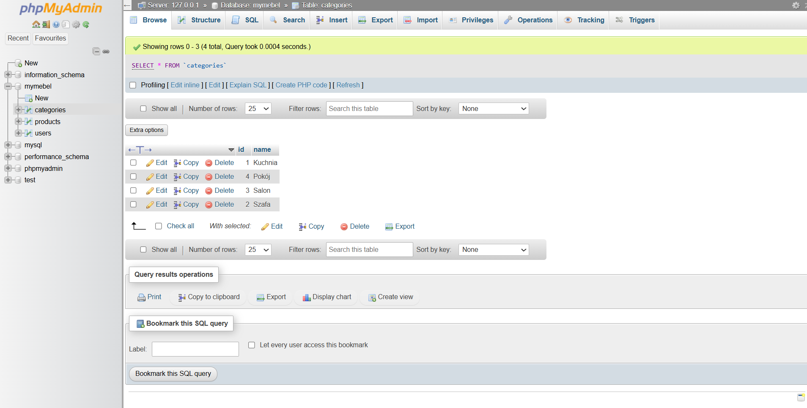

# MyMebel – strona internetowa dla firmy meblarskiej  

**Stack:** HTML, CSS, JavaScript, PHP, MySQL (XAMPP)  
**Rola:** Full-Stack Developer  

## Opis
MyMebel to responsywna aplikacja webowa stworzona jako katalog mebli na zamówienie.  
Projekt powstał w ramach zajęć "Technologie Internetowe" i łączy frontend z backendem oraz bazą danych MySQL.  
Aplikacja spełnia wymagania typowego sklepu internetowego, umożliwiając użytkownikom przeglądanie produktów, logowanie i rejestrację, a administratorowi – zarządzanie katalogiem.  

## Funkcje
- Przeglądanie produktów według kategorii (np. kuchnie, sofy)  
- Filtrowanie w katalogu produktów  
- Logowanie i rejestracja użytkowników (hasła haszowane)  
- Panel administratora (dodawanie i usuwanie produktów z bazy danych)  
- Obsługa bazy MySQL (produkty, kategorie, użytkownicy)  
- Interaktywne menu boczne (JavaScript)  

## Zrzuty ekranu

## Dokumentacja
 [Prezentacja projektu (PDF)](../../docs/mymebel-prezentacja.pdf)

[def]: ../../assets/screenshots/strona-glowna.png