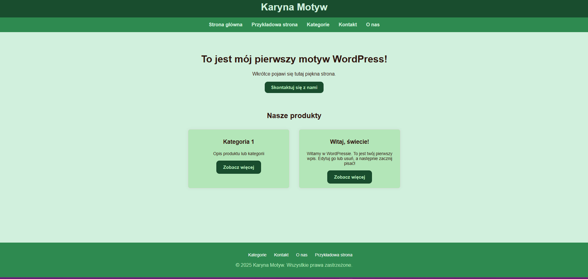
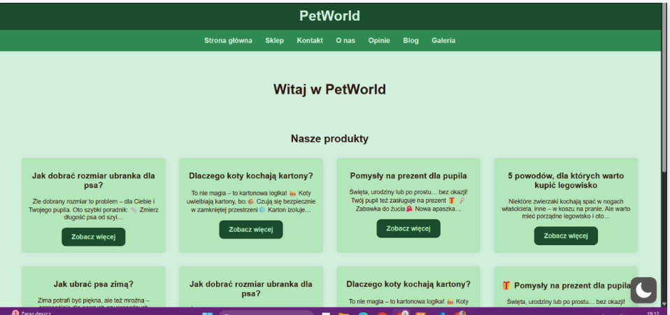

# 🐾 PetWorld — autorski motyw WordPress dla sklepu zoologicznego  

**Stack:** WordPress, HTML, CSS, PHP, WooCommerce, XAMPP  
**Rola:** Twórca motywu (projekt studencki)  
**Przedmiot:** Content Management Systems  
**Status:** zakończony (prezentacja poprzez zrzuty ekranu)  

## Opis
Projekt został zrealizowany w ramach przedmiotu **Content Management Systems**.  
Celem było stworzenie i wdrożenie autorskiego motywu WordPress, przeznaczonego dla sklepu internetowego z modą i akcesoriami dla zwierząt.  

Motyw został wykonany od podstaw w HTML, CSS i PHP, a następnie podłączony do WordPress.  
Środowisko testowe: **XAMPP** i hosting w chmurze CloudAccess (obecnie wygasły).  

## Funkcjonalności i struktura
- Responsywny układ strony (górne menu, stopka, sidebar)  
- Własne pliki szablonu: `index.php`, `style.css`, `functions.php`, `header.php`, `footer.php`, `page.php`, `single.php`, `sidebar.php`, `404.php`, `searchform.php`  
- Strona główna z nagłówkiem, opisem i CTA „Skontaktuj się z nami”  
- Podstrony: *O nas, Kontakt, Kategorie*  
- Sekcja produktów ze zdjęciami i przyciskami (integracja z WooCommerce)  
- Obsługa widgetów w pasku bocznym (sidebar)  
- Stylizacja przycisków w jednym spójnym stylu graficznym  
- Komentarze w kodzie w języku polskim i angielskim  

## Zrzuty ekranu

