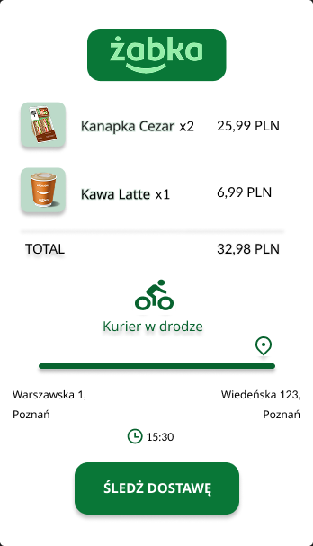
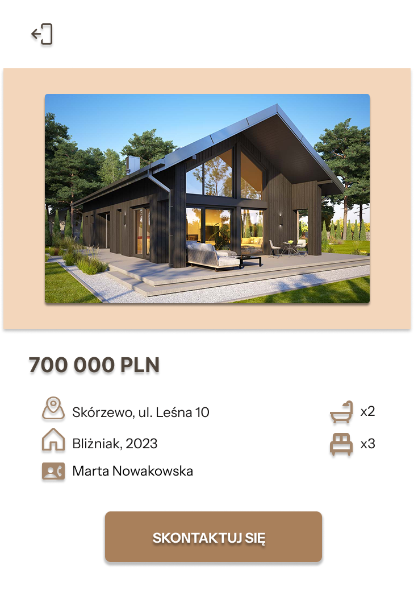

# UI/UX projekty

- **Interfejs aplikacji dostawy (Żabka)** — karta zamówienia z podsumowaniem i statusem „Kurier w drodze”.  
  

- **E-commerce (Levi’s — karta produktu)** — rozmiary, kolory, recenzje, miniatury, CTA „Do koszyka”.  
  

- **Karta oferty nieruchomości** — cena, parametry (pokoje/łazienki), CTA „Skontaktuj się”.  
  
